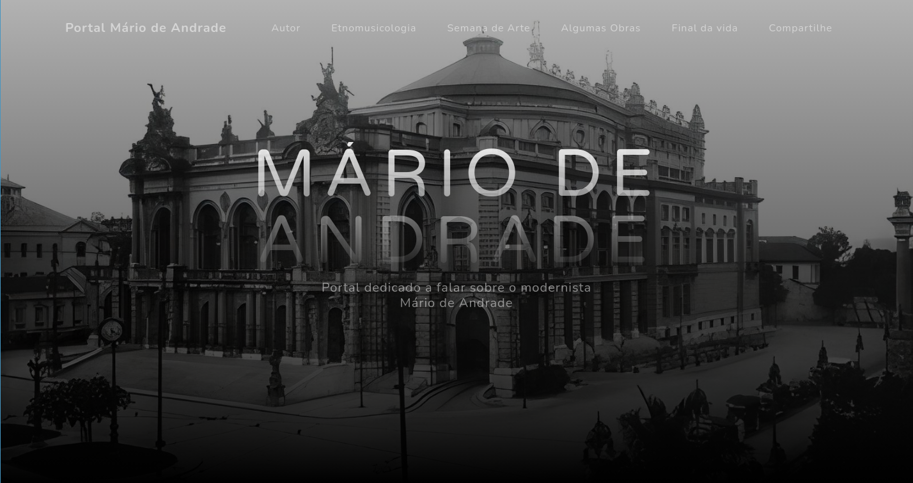

# Portal Mário de Andrade

Portal dedicado a falar sobre o modernista Mário de Andrade.

Trabalho em grupo para a matéria de português sobre o modernista Mário de Andrade.

# Tecnologias utilizadas

 

  

  

  
  
  
  

# Link

https://gabriel-antonio-souto.github.io/portal_mario_de_andrade/

# Integrantes

<ul>
  <li> Damaris Kamada
  <li> Gabriel Antonio
  <li> Guilherme Cabral
  <li> Igor Ferreira
<ul/>
